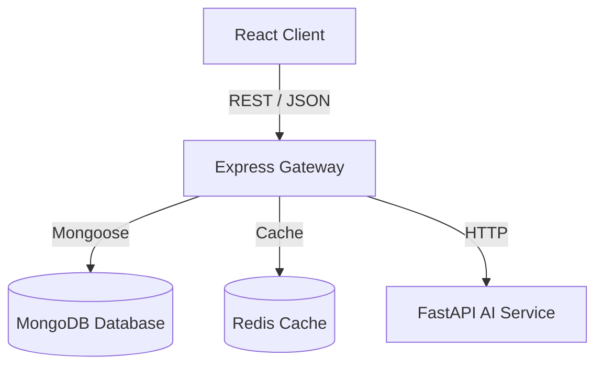

# Architecture Diagrams & Schematics

## System Overview

```mermaid
graph TD
    A[React Client] -->|REST / JSON| B[Express Gateway]
    B -->|Mongoose| C[(MongoDB Database)]
    B -->|Cache| D[(Redis Cache)]
    B -->|HTTP| E[FastAPI AI Service]
```
